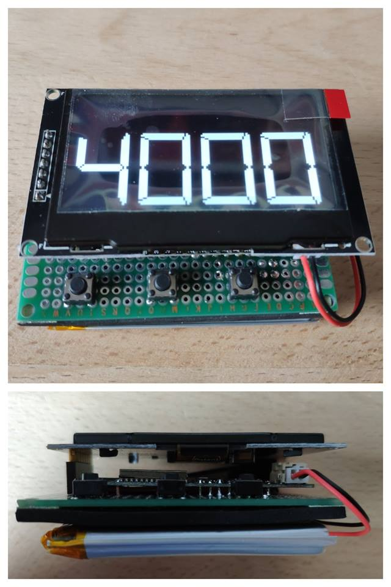

# diyaltimeter.de

The idea is to create an open source altimeter for skydiving. Currently the hardware is based on standard components connected with a custom pcb. So you can just order the pcb from [JLCPCB](https://www.jlcpcb.com/) and the rest of the parts from [Aliexpress](https://aliexpress.com). The cost should be <50$ depending on the type of housing you choose. 

## Features ( incl. Wishlist)

### General

- [OTA](https://github.com/marcelverdult/diyaltimeter.de/tree/master/ota) firmware updates
- keep logbook on internal storage
  - jump number
  - exit altitude
  - ff time
  - deployment altitude
  - cp time
  - plane
  - location
  - date/time
- sync logbook via WiFi (Wishlist - needs a backend)

### Ground
- sleep mode to save energy
- check pressure every xx seconds
- wake up on button press or climb detection

### Airplane 
- date/time
- altitude
- climb rate
- time to altitude

### Freefall
- altitude
- numbers as big as possible on screen

### Canopy
- altitude
- descent rate

## Hardware:
- ESP32 ( LOLIN D32 V1.0.0 - [Aliexpress](https://www.aliexpress.com/item/WEMOS-LOLIN32-V1-0-0-wifi-bluetooth-board-based-ESP-32-4MB-FLASH/32808551116.html) ~10$
  - built in LiPo charger
- 2x BMP280 sensors [Aliexpress](https://www.aliexpress.com/item/I2C-SPI-GY-BMP280-3-3-Digital-Barometric-Pressure-Altitude-Sensor-High-Precision-Atmospheric-Module-for/32651665846.html) (make sure to get the 6 pin version! Else you can't change the I2C address of the second sensor) ~2$
- 2.42" OLED SPI display [Aliexpress](https://www.aliexpress.com/wholesale?catId=0&SearchText=2.42+oled) ~20$
- 2.500mAh LiPo battery ~10$
- D3231 RTC module [Aliexpress](https://www.aliexpress.com/wholesale?catId=0&SearchText=d3231+rtc+raspberry) ~1$
- 3 buttons ~1$
- [custom PCB ](https://github.com/marcelverdult/diyaltimeter.de/tree/master/kicad)
- 3D printed housing with wristmount

## Test setup:

